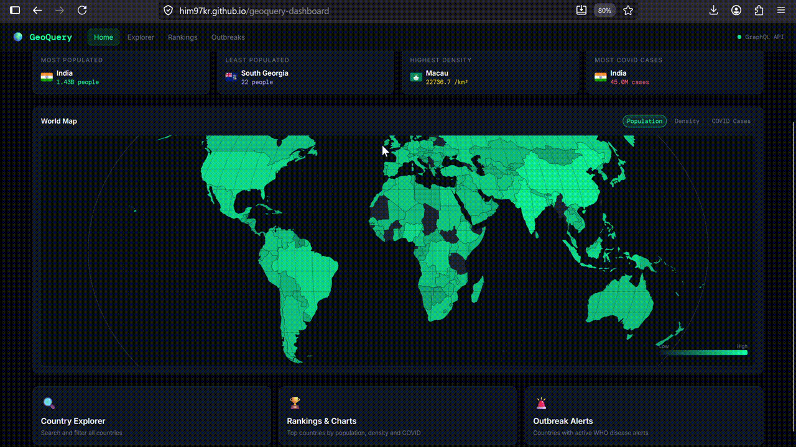
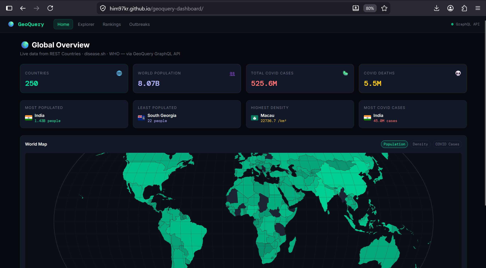
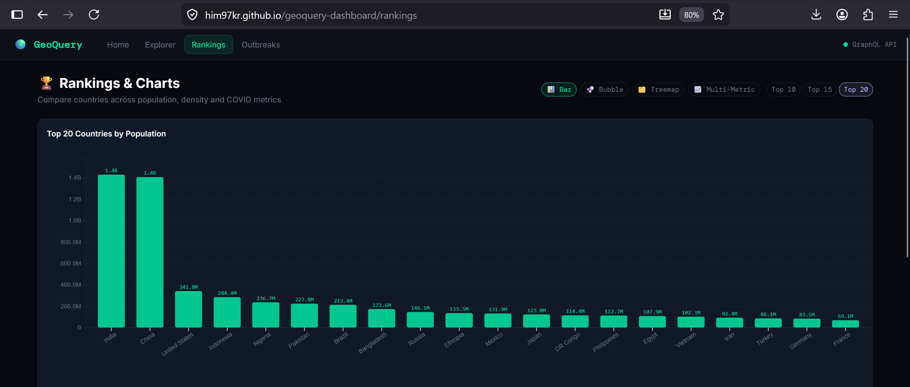
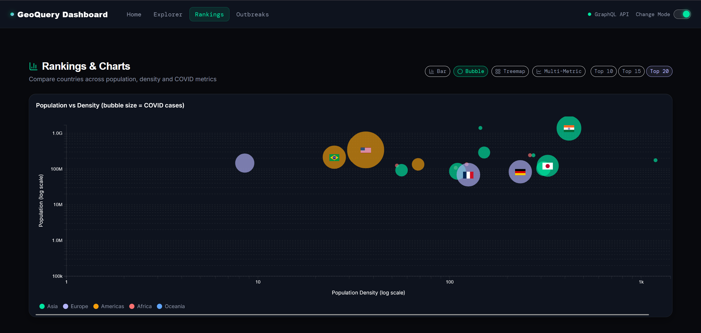
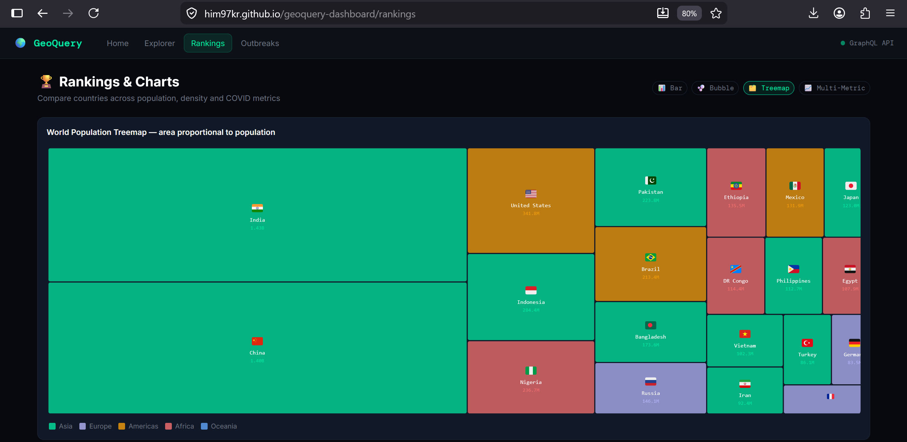
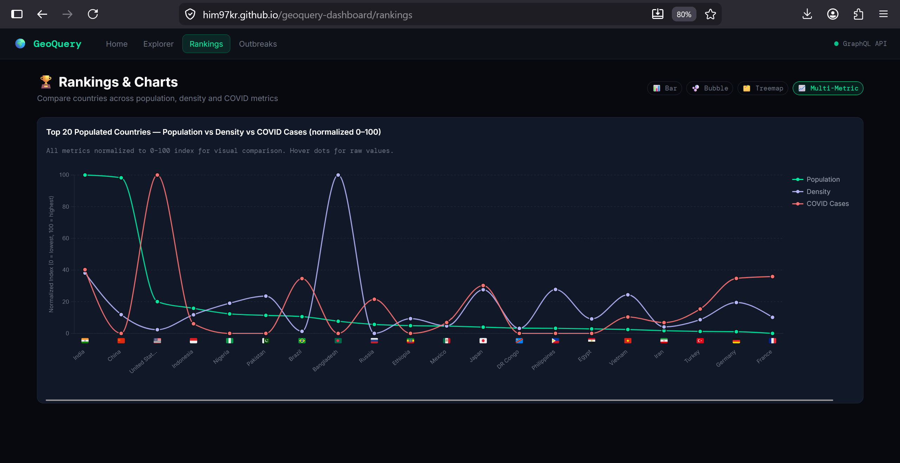
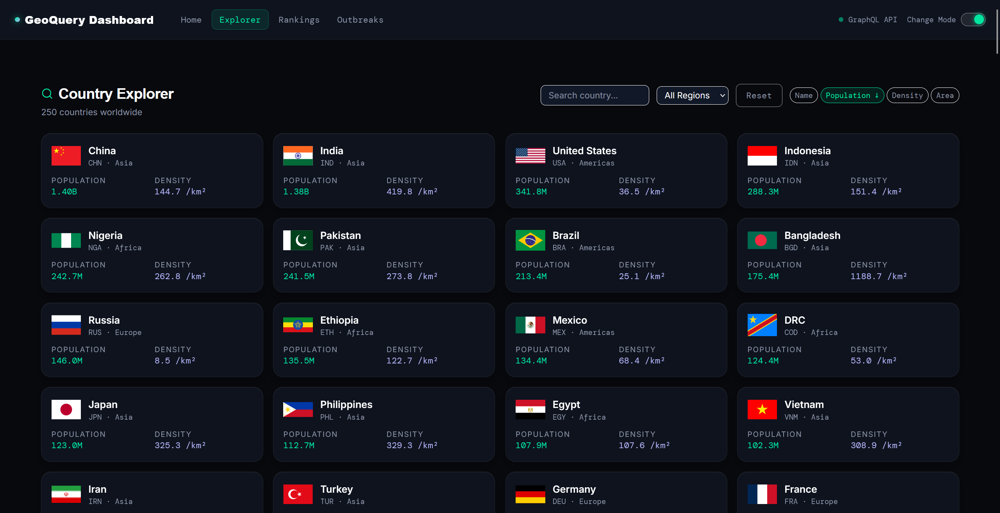
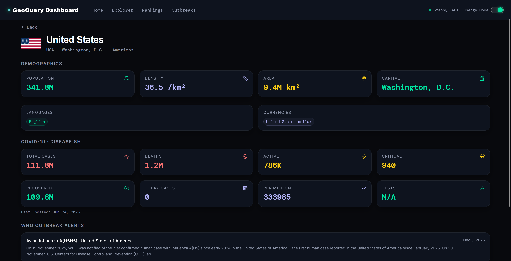
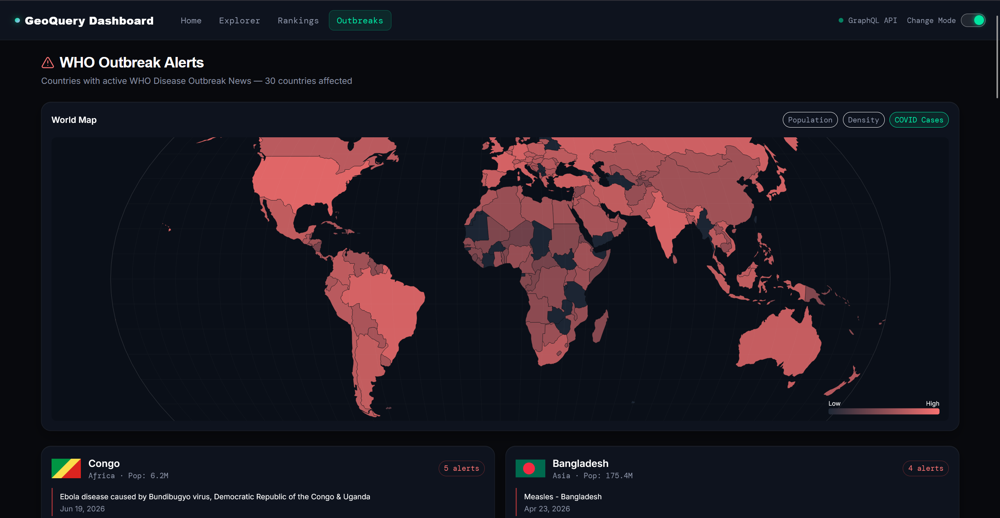
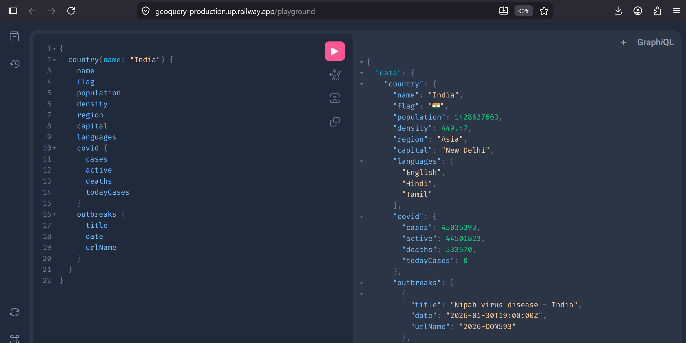

# 🖥️ GeoQuery Frontend

> React + Redux + D3.js dashboard that visualises country intelligence data via the [GeoQuery GraphQL API](https://github.com/Him97kr/geoquery).

[](https://react.dev)
[](https://redux-toolkit.js.org)
[](https://apollographql.com)
[](https://d3js.org)
[](https://tailwindcss.com)
[](https://jestjs.io)

---

## 🌐 Live

| | URL |
|---|---|
| **Dashboard** | https://him97kr.github.io/geoquery-dashboard |
| **GraphQL API** | https://geoquery.onrender.com |
| **GraphQL Playground** | https://geoquery.onrender.com/playground |

---

## 🎬 Demo



---

## 📸 public

### Home — Global Stats + World Map


### Rankings — Bar Chart


### Rankings — Bubble Chart


### Rankings — Treemap


### Rankings — Line Chart


### Explorer — Country Search & Filter


### Country Detail


### Outbreak — WHO Outbreak Alerts


### GraphQL Playground


---

## ✨ Features

- **Home** — global stats dashboard with world choropleth map
- **Explorer** — searchable, filterable, sortable country grid
- **Rankings** — bar charts, bubble charts, line charts via D3.js
- **Outbreaks** — WHO disease alert map and alert cards
- **Country Detail** — full demographics, COVID stats, WHO alerts per country
- **Redux Toolkit** — global state for filters, UI, and country data
- **Apollo Client** — GraphQL queries with fragment reuse and cache-first policy
- **D3.js** — bar, line, bubble, choropleth charts all animated

---

## 🚀 Quick Start

### Prerequisites
- Node.js 18+
- [GeoQuery API](https://github.com/Him97kr/geoquery) running on `localhost:8080`

```bash
# Clone
git clone https://github.com/Him97kr/geoquery-dashboard.git
cd geoquery-dashboard

# Install
npm install

# Set environment (dev)
echo "VITE_GRAPHQL_URL=http://localhost:8080/graphql" > .env.local

# Start dev server
npm run dev
```

Open `http://localhost:3000/geoquery-dashboard`

---

## 🧪 Testing

Unit and component tests run on **Jest + Enzyme**, covering Redux slices, hooks, D3 charts, and pages. Test files live under `src/tests/`, mirroring the `src/` layout.

```bash
npm test              # run once
npm run test:watch    # watch mode
npm run test:coverage # with coverage report
```

---

## 🚢 Deploy to GitHub Pages

```bash
# Set production API URL
echo "VITE_GRAPHQL_URL=https://geoquery.onrender.com/graphql" > .env.production

# Build and deploy
npm run deploy
```

---

## 🏗️ Architecture

```
Redux Store
├── countries  — list, selected, globalStats, topPopulation, topCovid, outbreaks
├── filters    — search, region, sort column, sort direction, rank limit
└── ui         — active chart type, map metric

Apollo Client  →  GeoQuery GraphQL API (Render)
└── Queries: country, countries, searchCountries,
             globalStats, topByPopulation, topByCovid,
             countriesWithOutbreaks
    └── Synced into Redux via custom hooks (useCountryData.js)

D3.js Charts
├── BarChart          — population, density, COVID rankings
├── BubbleChart       — population vs density vs COVID (log axes)
├── TreemapChart      — world population hierarchy by region
├── LineChart         — normalized multi-metric comparison (top 20)
└── ChoroplethMap     — world map with log-scale coloring, 3 metrics
```

---

## 📦 Stack

| Library | Purpose |
|---|---|
| React 18 | UI framework |
| Redux Toolkit | Global state — filters, UI, cached data |
| Apollo Client | GraphQL fetching + cache-first policy |
| D3.js v7 | All charts and world map |
| React Router v6 | Client-side routing |
| Tailwind CSS v3 | Utility-first dark theme styling |
| Vite | Build tool |
| Jest + Enzyme | Unit & component testing |

---

## 🔗 Related Projects

| Project | Description |
|---|---|
| [GeoQuery](https://github.com/Him97kr/geoquery) | Go GraphQL API that powers this frontend |
| [GeoVitals](https://github.com/Him97kr/chrome-extension-geovitals) | Chrome extension exploring similar country data |
| [World Population Dashboard](https://github.com/Him97kr/world-population-dashboard) | D3.js population visualisation |

---

## 👨‍💻 Author

**Himanshu**
- GitHub: [@Him97kr](https://github.com/Him97kr)
- LinkedIn: [Himanshu Kumar](https://in.linkedin.com/in/himanshu-kumar-518b71192)

---

## 📄 License

MIT License — see [LICENSE](LICENSE) for details.
